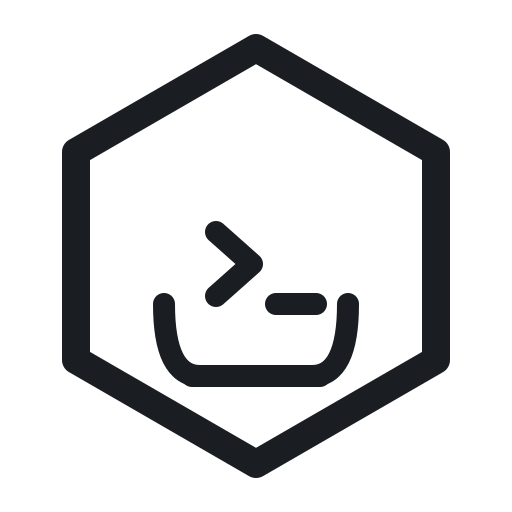

<p align="center">
  
</p>

# drydock

drydock is a sandbox for autonomous coding agents on macOS. Each task runs
in a per-task hardware-isolated VM; the agent never sees your real
Anthropic key — a host-side credential gateway issues short-lived
budgeted bearer tokens. Egress is deny-by-default. The only artifact
that leaves the sandbox is a captured `git diff`, and it doesn't reach
origin until you approve it.

Security claims:[`THREAT_MODEL.md`](THREAT_MODEL.md).  
Website: https://sricola.github.io/drydock/  

## Install

```bash
# Prerequisites (anything you don't already have)
brew install --cask container
brew install squid
```

The PR/MR adapters call `gh`, `glab`, or `tea` — install whichever your
repos use, and run their respective `auth login` before submitting a task.

### Option A — Homebrew (recommended)

```bash
brew tap sricola/drydock
brew install drydock
drydock init
```

Pulls a pre-built Apple-silicon binary from the latest tagged release
(currently `v0.1.2`); no Go toolchain required.

### Option B — Build from source

```bash
brew install go
git clone https://github.com/sricola/drydock && cd drydock
make install                             # PREFIX=/usr/local by default
make install PREFIX=$HOME/.local         # …or a user-owned prefix
drydock init
```

Either way, `drydock init` walks the remaining prereqs (container
service, `drydock-egress` network, sandbox + anchor images) and reports
per-step status. Idempotent — re-run any time.

## Run

```bash
export ANTHROPIC_API_KEY=sk-ant-...
drydock start              # foreground; ^C to stop. backgrounds via & or your launchd plist.
```

Quick liveness:

```bash
drydock status
# brokerd     up
# in flight   0 running · 0 awaiting egress · 0 awaiting diff · 0 pushing
# tasks       0 total · 0 in last 24h
# audit dir   /tmp/broker/audit
```

## Submit a task

In one shell, fire the task. **It blocks until the agent runs and you
approve the diff** (typical: a few seconds to a few minutes, plus your
review time):

```bash
drydock submit \
  --repo git@github.com:your-org/your-repo \
  --instruction "Add a one-line comment to README.md explaining the project."
```

A macOS notification fires when the diff is ready. In another shell:

```bash
drydock pending               # awaiting tasks (egress + diff gates both shown)
drydock review <id>           # diff in $PAGER, then prompt y/N — the one-shot path
                              # ─ or, step by step ─
less /tmp/broker/audit/<id>.diff
drydock approve <id>          # … or: drydock deny <id>
```

The submit shell unblocks with the push outcome:

```
task ab12cd34: pushed agent/ab12cd34 (github)
```

### Operator surface (other shell)

```bash
drydock status                # brokerd up?, breakdown (running · egress · diff · pushing)
drydock tasks                 # recent runs: id, age, duration, cost, outcome
drydock logs <id> [-f]        # stream-json audit (use -f to follow)
drydock kill <id>             # cancel the in-flight task (VM down + gate unblocked)
```

### Submit variations

```bash
# Long prompt from a file
drydock submit --repo … --instruction-file ./task.md

# Pipe from stdin
echo "Refactor the egress compiler" | drydock submit --repo … -

# Skip the approval gate (trusted batch run; see threat model)
drydock submit --repo … --instruction "…" --auto-approve

# Request additional egress (host:port[,port], repeatable; gated)
drydock submit --repo … --instruction "…" \
  --egress-extra internal.example.com:443 \
  --egress-extra files.example.com:443,8443

# Scripting — emit the raw response shape
drydock submit --repo … --instruction "…" --json | jq .branch
```

If you'd rather hit the HTTP API directly:

```bash
SOCK=$TMPDIR/drydock-$(id -u)/drydock.sock
curl --unix-socket "$SOCK" http://_/tasks \
  -H 'content-type: application/json' \
  -d '{ "repo_ref": "git@github.com:o/r", "instruction": "..." }'
```

Notifications opt-out: `DRYDOCK_NO_NOTIFY=1`.

### Platform selection

`repo_ref` must be a git URL (`https://`, `git@`, or `ssh://`); local
paths are rejected because adapters can't operate on filesystem origins.
The PR/MR adapter is chosen by `platform`:

- `"platform": "github"` → `gh pr create --fill` (needs `gh` authed)
- `"platform": "gitlab"` → `glab mr create --fill --yes` (needs `glab` authed)
- `"platform": "gitea"` (alias `forgejo`) → `tea pr create --head <branch>` (needs `tea` authed)
- `"platform": "none"` → push only; no PR/MR
- *omitted* → hostname autodetect (`github.com`, `gitlab.com`, `gitea.com`/`codeberg.org`; else push-only — covers Bitbucket and other self-hosted)

Self-hosted GitLab and Gitea need explicit `"platform"`. Bitbucket has no
widely-adopted CLI to wrap and falls back to push-only; contributions
welcome. The push response includes `"platform"` so the caller can see
which adapter ran. `"auto_approve": true` skips the gate — see the threat
model before using it.

## Where config lives

`drydock init` creates `~/.drydock/` at mode `0700` and seeds two files:

| Path | What |
|---|---|
| `~/.drydock/config.yaml` | Operator settings (network name, gateway IP, per-task budget + timeout, max concurrent tasks, paths, broker listener, behavior flags) |
| `~/.drydock/egress.yaml` | Squid + gateway allowlist (hosts and ports the sandbox may reach) |

Both files are seeded from defaults the first time; `drydock init` never
overwrites them. Env vars still win over file values (e.g.
`BROKER_ADDR=…` in the shell overrides `broker.addr` in the YAML), so
existing scripts keep working. `ANTHROPIC_API_KEY` is intentionally
**not** in either file — by design, it never goes to disk.

## Egress policy

`~/.drydock/egress.yaml` is the source of truth (seed template lives at
`$HOMEBREW_PREFIX/share/drydock/config/egress.yaml`). The default:

```yaml
default:
  domains:
    - { host: api.anthropic.com,      ports: [443] }   # routed via gateway
    - { host: registry.npmjs.org,     ports: [443] }   # routed via squid
    - { host: pypi.org,               ports: [443] }   # routed via squid
    - { host: files.pythonhosted.org, ports: [443] }   # routed via squid
per_task_widening:
  requires_approval: true
```

`api.anthropic.com` is intentionally excluded from the squid allowlist —
it routes through the credential gateway, not the proxy. Per-task widening
via `egress_extra` goes through the same human-driven gate as the diff
push (when `per_task_widening.requires_approval: true`, which is the
default): brokerd blocks the request, writes the requested hosts to
`AUDIT_ROOT/<id>.widen.json`, and shows the task in `drydock pending`
under gate `egress`. Approve with `drydock approve <id>` once you've
reviewed the request. Restart brokerd after editing the default
allowlist.

## Configuration

The canonical location is `~/.drydock/config.yaml` — seeded by `drydock
init` with the defaults below as a commented template. Edit and re-run
`drydock start`. Env vars still override file values for ops/scripting:

| Field (`config.yaml`) | Env override | Default | Meaning |
|---|---|---|---|
| — | `ANTHROPIC_API_KEY` | *(required)* | Real key; **host-only**, never goes to disk |
| `network` | `DRYDOCK_NETWORK` | `drydock-egress` | vmnet network name |
| `gateway_ip` | `DRYDOCK_GW_IP` | `192.168.66.1` | gateway + squid bind here |
| `sandbox_image` | `SANDBOX_IMAGE` | `claude-sandbox:latest` | per-task agent VM image |
| `anchor_image` | `DRYDOCK_ANCHOR_IMAGE` | `drydock-anchor:latest` | minimal sleep-forever image holding the vmnet gateway IP |
| `task_budget_usd` | `DRYDOCK_TASK_BUDGET_USD` | `2.0` | per-task USD ceiling |
| `max_concurrent_tasks` | `DRYDOCK_MAX_CONCURRENT_TASKS` | `2` | excess POSTs to `/tasks` get HTTP 503 |
| `task_timeout` | — | `30m` | wall-clock per task |
| `stage_root` / `audit_root` / `squid_run_dir` | `STAGE_ROOT` / `AUDIT_ROOT` / `SQUID_RUN_DIR` | `/tmp/broker/{stage,audit,squid}` | per-task scratch (audit dir is `0700`, audit log + diff are `0600`) |
| `broker.socket` | `BROKER_SOCKET` | `$TMPDIR/drydock-$UID/drydock.sock` | Unix socket (per-user parent dir at `0700`, socket at `0600`) |
| `broker.addr` | `BROKER_ADDR` | *(empty)* | set `host:port` to expose over TCP (warns at boot — see SECURITY.md) |
| `notifications` | `DRYDOCK_NO_NOTIFY=1` (off) | `true` | macOS notifications on pending approval |
| `log_json` | `DRYDOCK_LOG_JSON=1` | `false` | force JSON logs even on a TTY (default: terse text on TTY, JSON otherwise) |
| `strict_container_version` | `DRYDOCK_STRICT_CONTAINER_VERSION=1` | `false` | fail closed when `container` major drifts from the tested range |
| — | `EGRESS_CONFIG` | `~/.drydock/egress.yaml` | path override for the egress YAML |

Gateway port `8088` and squid port `3128` are hard-coded in
`cmd/brokerd/main.go` and `image/entrypoint.sh`; change both together.

## Troubleshooting

| Symptom | First place to look |
|---|---|
| `192.168.66.1 never became bindable` | `container ls -a` (anchor running?), `container network inspect drydock-egress` (gateway IP?) |
| Image build fails on `npm install` | Transient registry timeout; rerun `container build` |
| Squid CONNECT 403 to an expected host | `cat /tmp/broker/squid/squid-allow.txt`; add via `egress.yaml` or `egress_extra` |
| Stale anchor after a crash | `container rm -f drydock-anchor`; next brokerd start does this for you |
| Gateway 401 | Key wrong or placeholder (`sk-ant-fake` is *expected* to 401) |
| VM reaches a host it shouldn't | Confirm `init-firewall.sh` ran inside the VM — overriding `--entrypoint` skips it |

Per-task stream-json from the agent lands in `$AUDIT_ROOT/<id>.jsonl`; the
diff lands in `$AUDIT_ROOT/<id>.diff`.

## Layout

```
cmd/brokerd/      # broker daemon
cmd/drydock/      # operator CLI (init|start|submit|status|tasks|pending|review|approve|deny|kill|logs)
internal/
  broker/         # /tasks + admin handlers, approval + egress gates, concurrency, cancellation
  creds/          # Grant/Provider interfaces
  egress/         # YAML loader + allowlist compilation + host/port validation
  gateway/        # credential gateway (mint/serve/account/revoke), constant-time token check
  netfw/          # squid conf + allowlist compiler
  remote/         # PR/MR adapters: github (gh), gitlab (glab), gitea (tea), push-only
  runner/         # `container run` argv builder
  sockpath/       # shared per-uid socket path discovery for brokerd + CLI
  stage/          # work tree, host-side commit + push, curated adapter env
image/            # claude-sandbox: Dockerfile + entrypoint.sh + init-firewall.sh
image/anchor/     # drydock-anchor: FROM scratch + static Go sleep binary
tests/integration # //go:build integration — boots brokerd against real container CLI
config/           # egress.yaml
site/             # narrative explainer + launch post
docs/superpowers/ # historical design specs
LICENSE           # MIT
SECURITY.md       # how to report a security bug + documented residuals
THREAT_MODEL.md   # what drydock defends — and doesn't
Makefile          # build, install, test, test-integration, image, image-anchor, network, init, clean
```

## Build, test, CI

```bash
make build              # bin/brokerd, bin/drydock
make test               # go test -race ./...
make image              # both images
make image-sandbox      # per-task agent image
make image-anchor       # minimal anchor image (FROM scratch + static binary)
make test-integration   # boot brokerd as subprocess; macOS only, needs container runtime
```

GitHub Actions runs `go build`, `go test -race`, and `go vet` on every
push/PR. Integration (`make test-integration`) requires `container` and
is macOS-only — runs locally, not in CI. No real Anthropic spend.

## Known gaps

- Pricing in `internal/gateway/pricing.go` is point-in-time; bump when Anthropic publishes new rates.
- Up to `DRYDOCK_MAX_CONCURRENT_TASKS` tasks in flight per brokerd (default 2); raise on bigger hardware.
- No Slack/web approval adapters yet — only the local CLI + macOS notifications.
- Bitbucket PR/MR opening: push-only fallback (no widely-adopted CLI to wrap). Contribution slot.
- Apple `container` is v1.0; flag drift is the most likely breakage source. `DRYDOCK_STRICT_CONTAINER_VERSION=1` fails closed on drift.
