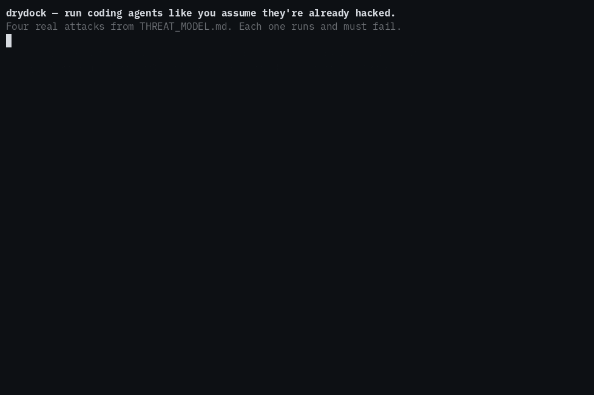

<p align="center">
  <picture>
    <source media="(prefers-color-scheme: dark)" srcset="site/logo-512-dark.png">
    
  </picture>
</p>

# drydock

<p align="center"><b>Let a coding agent run wild on your Mac — without trusting it.</b></p>

<p align="center">
  
  
  
  
</p>


drydock runs **Claude Code** or **OpenAI Codex** full-throttle on your own
repos, on your own Mac — no permission prompts, no babysitting. Each task runs
sealed in a throwaway VM, so the agent **can't touch your API key, can't reach
the open internet, and can't write to anything but a disposable copy**. The only
thing that ever comes back is a `git diff` — and nothing reaches your real code
until you approve it.

- **It never gets your key.** Your real API key stays on the host; the agent
  only ever sees a short-lived, budget-capped token.
- **It can't smuggle anything out.** The internet is deny-by-default — no
  exfiltrating your code, no calling home (you allow the package registries it
  needs, nothing else).
- **Nothing touches your repo until you say so.** You read the diff and approve
  it before it ever reaches `origin`.

Most agent tooling tries to keep the agent *well-behaved* — permission
prompts, output filters, policy. drydock takes the opposite stance: **contain
the blast radius** so a hostile agent (a poisoned repo, a malicious
dependency, a prompt-injection that turns a fetched URL into a shell command)
can't reach your key, your filesystem, your push credentials, or the open
internet — regardless of what it tries.

<p align="center">
  
</p>

<p align="center"><sub><b>Don't take the threat model's word for it.</b> Every green above is a real <code>go&nbsp;test</code> red-team case that runs the actual attack and asserts it fails. Reproduce them yourself: <code>make&nbsp;redteam</code> — or watch all seven, including live VM isolation, with <code>make&nbsp;demo&nbsp;VM=1</code>.</sub></p>

> **Status: working alpha (v0.3.0).** The full task lifecycle works
> end-to-end — submit → isolated VM → gated diff → push — and drydock ships
> through a Homebrew tap. It is pre-1.0 and single-maintainer: only `main` is
> supported, behavior and config can change between minor versions, and it
> hasn't been hardened by real-world use. **There has been no third-party
> security audit** — the security model is written down in detail in the
> [threat model](THREAT_MODEL.md), so read that and decide for yourself
> before trusting it. **Hard requirement: macOS 26+ on Apple silicon** — it
> runs on Apple's `container` runtime (itself 1.0), so it won't run anywhere
> else.

**[Docs](https://sricola.github.io/drydock/docs/)** ·
[Threat model](THREAT_MODEL.md) ·
[Website](https://sricola.github.io/drydock/) ·
[Roadmap](docs/ROADMAP.md)

## Who it's for

- **For:** unattended or batch agent runs you don't want to babysit, and anyone
  who'd rather *contain* an agent than trust it to behave.
- **Not for:** interactive sessions where you're watching every step (that's
  overkill), or anything off macOS 26+ Apple silicon (it won't run).  

## Install & first task

> **Eligible?** drydock runs **locally on your Mac**, so it needs **macOS 26+ on
> Apple silicon** (Apple's `container` runtime ships nowhere else). Check:
> ```bash
> [ "$(uname -m)" = arm64 ] && [ "$(sw_vers -productVersion | cut -d. -f1)" -ge 26 ] \
>   && echo "eligible" || echo "not yet — needs macOS 26+ on Apple silicon"
> ```

```bash
# install + set up the runtime, squid, and ~/.drydock
brew install sricola/drydock/drydock
drydock setup

# give it a credential (or use a subscription — see the auth docs)
export ANTHROPIC_API_KEY=sk-ant-...
drydock start

# in another shell: your first sandboxed task
drydock submit --repo git@github.com:you/repo \
  --instruction "Add a one-line comment to README.md."
drydock review <id>     # read the diff, then approve or deny
```

That's the whole loop: the agent runs sealed, hands back a `git diff`, and
nothing reaches your repo until you approve it. The full walkthrough is in the
**[Quickstart](https://sricola.github.io/drydock/docs/quickstart.html)**.

Prefer to build from source? `brew install go`, clone, then `make install &&
drydock init`.

## Documentation

Full operator docs live at **[sricola.github.io/drydock/docs](https://sricola.github.io/drydock/docs/)**:

- [Quickstart](https://sricola.github.io/drydock/docs/quickstart.html) — install to first task.
- [Authentication](https://sricola.github.io/drydock/docs/authentication.html) — API key or subscription, Claude Code & Codex.
- [Submitting tasks](https://sricola.github.io/drydock/docs/submitting-tasks.html) — `drydock submit`, the approval gate, flags, scripting.
- [Egress & widening](https://sricola.github.io/drydock/docs/egress.html) — the allowlist and per-task widening.
- [Configuration](https://sricola.github.io/drydock/docs/configuration.html) — `config.yaml` and env overrides.
- [Troubleshooting](https://sricola.github.io/drydock/docs/troubleshooting.html) — `drydock doctor` and common failures.
- [Threat model](THREAT_MODEL.md) — what drydock defends, and what it doesn't.

## Prove it yourself

You don't have to trust the threat model — run the attacks. `drydock redteam`
boots throwaway VMs and runs the real red-team cases behind the security claims
(key isolation, deny-by-default egress, VM teardown) and prints a pass/fail
table. **No API key, no spend, ~5 minutes.**

```bash
drydock redteam        # live containment attacks
make demo VM=1         # …or watch all seven, including live VM isolation
```

## Contributing & internals

Codebase layout, build/test/CI, and known gaps are in
[`CONTRIBUTING.md`](CONTRIBUTING.md). Security reporting and documented
residuals are in [`SECURITY.md`](SECURITY.md).

## License

MIT — see [`LICENSE`](LICENSE).
